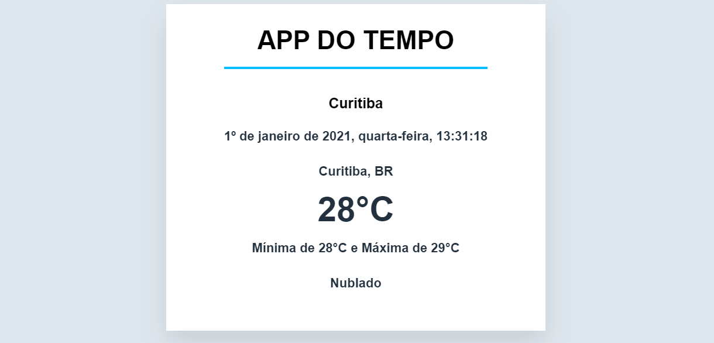
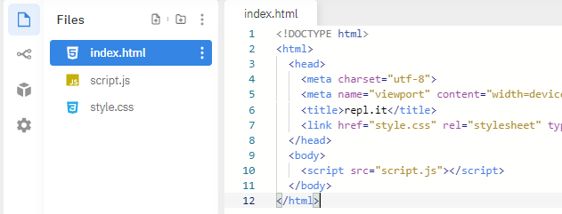
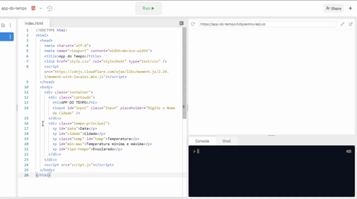

<center>Crie um app para checar o tempo com HTML, CSS e JavaScript</center>  
<center>Feito por <a href="https://github.com/gautamjajoo" target="_blank">@gautamjajoo</a></center>
<center>Traduzido por <a href="https://github.com/vitorvavolizza" target="_blank">@vitorvavolizza</a></center>

<br />

Você é um iniciante em JavaScript e não sabe por onde começar? Se sim, você está no lugar certo! Ser um iniciante na programação e ter que aprender os fundamentos pode ser muito doloroso - mas a melhor maneira de aprender é construindo projetos simples e divertidos! Neste workshop, você vai construir um aplicativo que usa APIs da web para obter o clima de qualquer cidade.

Aqui está como ficará a versão final:



O [código fonte](https://repl.it/@hcbjcentro/app-do-tempo) e a [demo](https://app-do-tempo.hcbjcentro.repl.co/) estão aqui.

Ao final deste workshop, você terá aprendido como usar as APIs da web, e você poderá expandi-lás ainda mais criativamente em projetos futuros. Você também aprenderá alguns fundamentos do JavaScript, bem como alguns bons truques de CSS para fazer belos designs.

## 1. Pré-requisitos

Conhecimento básico de HTML, CSS e Javascript/JSON.

Se você não conhece nenhum dos conceitos acima, não se preocupe! Este workshop irá guiá-lo através desses conceitos.

## 2. Montagem do projeto no Repl.it

Vamos usar o [Repl.it](https://repl.it) para este workshop. O Repl.it é um poderoso editor de código colaborativo on-line.

Comece criando um [novo projeto HTML/CSS no repl.it](https://repl.it/languages/html).

Você deve ver três arquivos: `index.html`, `style.css`, e `script.js`.



## 3. Criando o esqueleto do app

Vamos começar adicionando um pouco de código ao arquivo `index.html`. As linhas básicas já estão adicionadas no arquivo.

Na linha 1, temos `<!DOCTYPE html>`. Isto declara que este arquivo é um arquivo `HTML`. Se dermos uma olhada na tag `<html>`, encontraremos uma tag `<body>`. É lá que vamos escrever o código.
Se você der uma olhada na tag `<head>` em seu `HTML`, você encontrará a linha de código:

```html
<link href="style.css" rel="stylesheet" type="text/css" />
```

Isto significa que seu arquivo HTML está vinculado ao seu arquivo CSS e se você olhar para a tag `<body>` você encontrará

```html
<script src="script.js"></script>
```

Isto significa que seu arquivo HTML está vinculado ao seu JavaScript.

Vamos iniciar o projeto alterando o título do projeto. Depois de mudar o título, o arquivo HTML terá um aspecto semelhante a este:

```html
<!DOCTYPE html>
<html>
  <head>
    <meta charset="utf-8" />
    <meta name="viewport" content="width=device-width" />
    <title>App do Tempo</title>
    <link href="style.css" rel="stylesheet" type="text/css" />
  </head>
  <body>
    <script src="script.js"></script>
  </body>
</html>
```

Além do arquivo padrão `script.js`, também estaremos utilizando a [`moment.js`](https://momentjs.com/), uma biblioteca JavaScript para exibir a data e a hora do usuário.

Para ligar arquivos externos como o `moment.js` utilizaremos o [`CDNJS`](https://cdnjs.com/), que é um serviço CDN de código aberto alimentado pelo Cloudflare.

Adicione

```html
<script src="https://cdnjs.cloudflare.com/ajax/libs/moment.js/2.29.1/moment-with-locales.min.js"></script>
```

dentro da tag `<head>`.

Como vinculamos o arquivo `JS` com o arquivo `HTML`, agora podemos começar a fazer um cartão no qual mostraremos o conteúdo.

Dentro de nosso `<body>` adicionaremos um `<div>` com classe `container` para nosso cartão principal, já para o conteúdo dentro do cartão adicionaremos outro `<div>` com classe de `conteudo`.

```html
<div class="container">
  <div class="conteudo"></div>
</div>
```

Certifique-se de fechar as tags `</div>` que foram declaradas acima.

Em seguida, adicione um título ao nosso aplicativo utilizando `<h1>` dentro do conteúdo.

```html
<h1>APP DO TEMPO</h1>
```

Para inserir a cidade do usuário, utilizamos a tag `input` e a declaramos com classe equivalente a `input` e `id` como `input`.

`class` é utilizado para passar informações no `CSS` e o `id` é utilizado para o `JavaScript`.

Além disso, adicione um `placeholder` que orienta o usuário sobre o valor esperado na entrada.

```html
<input id="input" class="input" placeholder="Digite o Nome da Cidade" />
```

Na linha seguinte, feche o `<div>` do `conteudo`:

```html
<div class="conteudo">
  <h1>APP DO TEMPO</h1>
  <input id="input" class="input" placeholder="Digite o Nome da Cidade" />
</div>
```

Depois do conteúdo, acrescentaremos um `<div>` com classe `tempo-principal` para exibir os detalhes do tempo.

```html
<div class="tempo-principal"></div>
```

Dentro desse div utilizaremos `<p>` para cada detalhe que exibimos. Atribuiremos um `id` a cada detalhe do tempo que exibirmos. Portanto, declaramos os detalhes meteorológicos da seguinte maneira:

```html
<div class="tempo-principal">
  <p id="data">Data</p>
  <p id="cidade">Cidade</p>
  <p id="temp">Temperatura</p>
  <p id="min-max">Temperatura miníma e máxima</p>
  <p id="tipo-tempo">Ensolarado</p>
</div>
```

Além disso, acrescente uma `classe` com o valor `temp` à tag `<p>` que declara a temperatura porque desejamos exibir a temperatura da cidade com fonte maior do que os outros detalhes.

```html
<div class="tempo-principal">
  <p id="data">Data</p>
  <p id="cidade">Cidade</p>
  <p class="temp" id="temp">Temperatura</p>
  <p id="min-max">Temperatura miníma e máxima</p>
  <p id="tipo-tempo">Ensolarado</p>
</div>
```

Certifique-se de fechar todas as tags `</div>` que foram declaradas inicialmente.

Nosso código `HTML` está pronto e agora podemos passar para a parte do `CSS`. No final, o código `HTML` terá este aspecto:

```html
<!DOCTYPE html>
<html>
  <head>
    <meta charset="utf-8" />
    <meta name="viewport" content="width=device-width" />
    <title>App do Tempo</title>
    <link href="style.css" rel="stylesheet" type="text/css" />
    <script src="https://cdnjs.cloudflare.com/ajax/libs/moment.js/2.29.0/moment.min.js"></script>
  </head>
  <body>
    <div class="container">
      <div class="conteudo">
        <h1>APP DO TEMPO</h1>
        <input id="input" class="input" placeholder="Digite o Nome da Cidade" />
      </div>
      <div class="tempo-principal">
        <p id="data">Data</p>
        <p id="cidade">Cidade</p>
        <p class="temp" id="temp">Temperatura</p>
        <p id="min-max">Temperatura miníma e máxima</p>
        <p id="tipo-tempo">Ensolarado</p>
      </div>
    </div>
    <script src="script.js"></script>
  </body>
</html>
```

## 4. Melhorando o esqueleto do projeto usando CSS

Iniciaremos o código `CSS` adicionando estilo ao `<body>`.

Começaremos adicionando uma `background-color` (cor de fundo) ao nosso site. Com o CSS, as cores podem ser especificadas de diferentes maneiras e uma das maneiras é utilizando o valor `hexadecimal`. Neste aplicativo estaremos utilizando o valor `hexadecimal`, ou seja, `#dfe7ee` que faz com que a cor de fundo seja cinza azulado.

Se você quiser personalizar a cor, você pode utilizar o [HTML Color Picker](https://www.w3schools.com/colors/colors_picker.asp) da W3School para obter o valor `hexadecimal` da cor que você quiser.

Definiremos o valor do display como `flex` porque o `flex` permite alinhar perfeitamente seus itens ao centro sem utilizar flutuação ou posicionamento.
Além disso, adicionaremos `font-size` (tamanho de fonte), `line-height` (altura da linha) e `font-family` (família da fonte) para estilizar o texto dentro de nosso body.

Navegue até o arquivo `style.css` no seu projeto e adicione:

```css
body {
  background-color: #dfe7ee;
  line-height: 1.5;
  font-size: 125%;
  display: flex;
  font-family: sans-serif;
}
```

Agora vamos começar a fazer o cartão. Como mencionado anteriormente no projeto, atribuímos uma `background-color` ao nosso container.
Em seguida, utilizaremos o `padding` (preenchimento) para gerar espaço em torno de nosso elemento dentro das bordas definidas. Da mesma forma, adicionamos `margin` (margem) para criar espaço ao redor dos elementos, mas fora das bordas definidas. Estas propriedades nos ajudam a posicionar o cartão em nossa página web. Padding é o espaço entre o conteúdo e a borda, enquanto que margin é o espaço fora da borda.

Em seguida, adicionaremos uma sombra atrás do cartão para dar-lhe um efeito de destaque. Para isso, estaremos utilizando a função `drop-shadow()` que aplica um efeito de sombra projetada ao cartão que criamos.

Para maiores informações sobre o `webkit-filter` consulte o [Mozilla Docs](https://developer.mozilla.org/en-US/docs/Web/CSS/filter-function/drop-shadow)

```css
.container {
  background-color: #fff;
  padding: 0 4.5em 7em;
  margin: 1em auto 0 auto;
  -webkit-filter: drop-shadow(0 1em 1em rgba(0, 0, 0, 0.1));
  filter: drop-shadow(0 1em 1em rgba(0, 0, 0, 0.1));
}
```

Em seguida, acrescentaremos algumas propriedades ao nosso cabeçalho, acrescentando o seguinte código:

```css
h1 {
  border-bottom: 4px solid deepskyblue;
  padding-bottom: 0.25em;
  margin-bottom: 1em;
  text-align: center;
}
```

Até agora, estilizamos quase todos os elementos e só precisamos estilizar a caixa de texto e os detalhes que desejamos exibir.

Para a caixa de texto, adicionamos o seguinte código:

```css
.input {
  border: none;
  outline: none;
  font-size: 1.4rem;
  text-align: center;
  font-weight: bold;
  display: flex;
  margin-left: auto;
  margin-right: auto;
}
```

Vamos definir `border` (borda) e `outline` (contorno) com o valor `none` que vai deletar a linha exibida ao redor da caixa de texto.

E para os detalhes do tempo, vamos utilizar esse código:

```css
.tempo-principal {
  display: none;
  line-height: 2.2rem;
  height: 30vh;
  text-align: center;
  color: #23313e;
  font-weight: bold;
}

.temp {
  margin: 25px;
  font-size: 40pt;
}

#tipo-tempo {
  text-transform: capitalize;
}
```

Aqui utilizaremos `display: none` porque desejamos esconder tudo antes de qualquer texto. De resto, todos os elementos são propriedades básicas do `CSS`.

Nosso arquivo CSS deve ficar assim:

```css
body {
  background-color: #dfe7ee;
  line-height: 1.5;
  font-size: 125%;
  display: flex;
  font-family: sans-serif;
}

/*---------------------------------------CARTÃO------------------------------------------*/

.container {
  background-color: #fff;
  padding: 0 4.5em 7em;
  margin: 1em auto 0 auto;
  -webkit-filter: drop-shadow(0 1em 1em rgba(0, 0, 0, 0.1));
  filter: drop-shadow(0 1em 1em rgba(0, 0, 0, 0.1));
}

/* ------------------------------------------------------------------------------------------*/

h1 {
  border-bottom: 4px solid deepskyblue;
  padding-bottom: 0.25em;
  margin-bottom: 1em;
  text-align: center;
}

/*-----------------------------------CAIXA DE TEXTO---------------------------------------*/

.input {
  border: none;
  outline: none;
  font-size: 1.4rem;
  text-align: center;
  font-weight: bold;
  display: flex;
  margin-left: auto;
  margin-right: auto;
}

/*------------------------------------DETALHES----------------------------------------- */

.tempo-principal {
  display: none;
  line-height: 2.2rem;
  height: 30vh;
  text-align: center;
  color: #23313e;
  font-weight: bold;
}

.temp {
  margin: 25px;
  font-size: 40pt;
}

#tipo-tempo {
  text-transform: capitalize;
}
```

## 5. Adicionando JS e aprendendo como trabalhar com APIs

### O que são APIs e como funcionam?

API significa Application Programming Interface (Interface de Programação de Aplicações). Uma API é um mensageiro que entrega seu pedido ao provedor do qual você está solicitando e depois entrega a resposta de volta para você. Em termos leigos, uma API é como um garçom em um restaurante onde você é o cliente e o chef é o provedor. Você encomenda a comida ao garçom e o garçom informa ao chef e depois serve a comida de volta ao cliente.

Os desenvolvedores usam as APIs para tornar seus trabalhos mais eficientes reutilizando o código e apenas mudando a parte que é relevante para o processo que eles querem melhorar.

Para este projeto, estaremos usando uma API de tempo, a [OpenWeather](https://openweathermap.org/api).

Para começar, você terá que criar uma conta no OpenWeather para gerar uma chave API para você mesmo.


Após o registro, dirija-se à seção [API](https://openweathermap.org/api).

Estaremos utilizando a API `Current Weather Data`. Inscreva-se na API e depois disso, você receberá a chave em seu [perfil](https://home.openweathermap.org/api_keys).


Depois de estabelecer a chave, vamos agora ler os documentos para saber em que formato a API responde. Os [docs](https://openweathermap.org/current) contêm o formato da chamada API, na aba `By City name`.


O formato da API é algo parecido com isto:

```
API.openweathermap.org/data/2.5/weather?q={city name}&appid={API key}
```

Aqui, vamos dividir a API em duas partes, a primeira será a URL base e a segunda será a chave da API.

Uma vez que temos uma ideia aproximada sobre a API dada, podemos agora começar a codificar o arquivo JS.

No início, definimos uma constante chamada `api` que contém nossa URL base e a chave.

Navegue até o arquivo `script.js` e adicione:

```js
const api = {
  key: '**************************************',
  base: 'https://api.openweathermap.org/data/2.5/weather?',
};
```

Substitua a `chave` pela sua chave API presente no seu perfil.

Agora adicionaremos uma função para pegar a cidade de entrada quando o usuário pressionar a tecla Enter. Também no mesmo loop, adicionaremos a função para exibir a data e a hora do usuário naquele momento em particular utilizando a `moment.js`.

O formato de data e hora que vamos utilizar é:

```js
Mo [de] MMMM [de] YYYY, dddd, HH:mm:ss
```

Muitos outros formatos e informações são mencionados no [Docs da Moment.js](https://momentjs.com/docs/).

Em seguida, adicione o seguinte código:

```js
const Input = document.getElementById('input');

Input.addEventListener('keypress', (event) => {
  if (event.keyCode == 13) {
    getTempo(Input.value);

    /*-------------------FUNÇÃO PARA MOSTRAR A DATA E A HORA USANDO A MOMENT.JS-------------------*/

    const data = moment().locale('pt-br');
    document.getElementById('data').innerHTML = data.format(
      'Mo [de] MMMM [de] YYYY, dddd, HH:mm:ss'
    );

    document.querySelector('.tempo-principal').style.display = 'block'; //mostra os detalhes no display, já que inicialmente eles não são mostrados
  }
});
```

Na função acima, a entrada do usuário é armazenada na `const Input` utilizando `document.getElementById`. O método `getElementById()` devolve o elemento que tem o atributo ID com o valor especificado.

Após o usuário pressionar enter (cujo código é `13`), enviaremos o valor para a nova função `getTempo` que criaremos para obter os detalhes meteorológicos da API. O método `addEventListener()` anexará um manipulador de eventos ao elemento especificado.

Além disso, armazenaremos a data em uma `const data` e a traduziremos para pt-br utilizando o formato da `moment.js` mencionado nos documentos.

Como definimos o `display` como `none` inicialmente na classe `tempo-principal` com `CSS`, adicionamos

```js
document.querySelector('.tempo-principal').style.display = 'block';
```

para definir o `display` como `block`, caso contrário, após uma consulta, não poderemos ver mais detalhes.

Agora vamos criar a função `getTempo` para obter os detalhes da API.

```js
function getTempo(cidade) {
  fetch(`${api.base}q=${cidade}&appid=${api.key}&units=metric&lang=pt_br`)
    .then((detalhes) => {
      return detalhes.json();
    })
    .then(mostrarTempo);
}
```

O valor de entrada do usuário que é passado através da função acima é armazenado em `cidade`. Como conhecemos o formato da API, buscaremos os detalhes meteorológicos do provedor utilizando a API. Aqui a `api.base` é declarada na primeira linha e a `api.key` na segunda linha do arquivo `JS` e a `cidade` é a entrada do usuário.

O `.then()` é um método em `JS` que foi definido na `Promise API` e é utilizado para lidar com tarefas assíncronas, como uma chamada API.
Anteriormente, funções de retorno eram utilizadas em vez desta função, o que dificultava a manutenção do código.
Mais informações sobre promessas são mencionadas nos [Docs de Desenvolvedor da Mozilla](https://developer.mozilla.org/en-US/docs/Web/JavaScript/Guide/Using_promises).

Também acrescentaremos `units=metric` no final, já que a API retorna em Fahrenheit e queremos que a temperatura esteja em Celsius.

Ao buscarmos os detalhes meteorológicos, os parâmetros são armazenados no formato `JSON` de `detalhes`. Esses detalhes são então passados para a função `mostrarTempo`, de modo que podemos exibi-los ao usuário.

Agora estamos na última etapa da criação de nosso aplicativo, onde precisamos criar uma função `mostrarTempo` para exibir os detalhes que recebemos da
API.

```js
function mostrarTempo(detalhes) {
  // Vamos pegar os valores recebidos da API e usar nessa função.
}
```

Aqui passamos os `detalhes` recebidos da API para a função `mostrarTempo`.

Antes de programar mais, devemos tentar ver o que obtemos da API utilizando o `console.log()`.

```js
function mostrarTempo(detalhes) {
  // Vamos pegar os valores recebidos da API e usar nessa função.
  console.log(detalhes);
}
```

A API deve retornar algo parecido com isso:

```json
base: "stations",
clouds: { 
  "all": 75 
},
 coord: { 
   "lon": -49.2908, 
   "lat": -25.504 
},
main: { 
  "temp": 27.08,
  "feels_like": 24.86,
  "temp_min": 27,
  "temp_max": 27.22,
  "pressure": 1015,
  "humidity": 61 
},
name: "Curitiba",
sys: {
  "type": 1,
  "id": 8346,
  "country": "BR",
}
```

E podemos usar esses detalhes no nosso app!

```js
function mostrarTempo(detalhes) {
  // Vamos pegar os valores recebidos da API e usar nessa função.

  // console.log(detalhes);
  let cidade = document.getElementById('cidade');
  cidade.innerHTML = `${detalhes.name}, ${detalhes.sys.country}`;

  let temperatura = document.getElementById('temp');
  temperatura.innerHTML = `${Math.round(detalhes.main.temp)}°C`;

  let minMax = document.getElementById('min-max');
  minMax.innerHTML = ` Mínima de ${Math.round(
    detalhes.main.temp_min
  )}°C e Máxima de ${Math.round(detalhes.main.temp_max)}°C`;

  let tipoTempo = document.getElementById('tipo-tempo');
  tipoTempo.innerHTML = `${detalhes.weather[0].description}`;
}
```

Como estamos utilizando `JSON` para acessar os detalhes, o formato para obter os detalhes é algo como este `detalhes.propriedade`, onde `detalhes` é nosso objeto `JSON` e `propriedade` pode ser qualquer elemento desse objeto. Para escolher a `propriedade` correta, temos que ver o registro do console dos detalhes que recebemos da API.
A propriedade `innerHTML` retorna o conteúdo do elemento para o HTML.

Para arredondar a temperatura, estamos utilizando a função `Math.round()`.

O código JS deve ficar parecido com isto:

```js
const api = {
  key: '5c70b564b6caacf38f10fd75ea284f6d',
  base: 'https://api.openweathermap.org/data/2.5/weather?',
};

const Input = document.getElementById('input');

Input.addEventListener('keypress', (event) => {
  if (event.keyCode == 13) {
    getTempo(Input.value);

    /*-------------------FUNÇÃO PARA MOSTRAR A DATA E A HORA USANDO A MOMENT.JS-------------------*/

    const data = moment().locale('pt-br');
    document.getElementById('data').innerHTML = data.format(
      'Mo [de] MMMM [de] YYYY, dddd, HH:mm:ss'
    );

    document.querySelector('.tempo-principal').style.display = 'block'; //mostra os detalhes no display, já que inicialmente eles não são mostrados
  }
});

function getTempo(cidade) {
  fetch(`${api.base}q=${cidade}&appid=${api.key}&units=metric&lang=pt_br`)
    .then((detalhes) => {
      return detalhes.json();
    })
    .then(mostrarTempo);
}

function mostrarTempo(detalhes) {
  // Vamos pegar os valores recebidos da API e usar nessa função.

  // console.log(detalhes);
  let cidade = document.getElementById('cidade');
  cidade.innerHTML = `${detalhes.name}, ${detalhes.sys.country}`;

  let temperatura = document.getElementById('temp');
  temperatura.innerHTML = `${Math.round(detalhes.main.temp)}°C`;

  let minMax = document.getElementById('min-max');
  minMax.innerHTML = ` Mínima de ${Math.round(
    detalhes.main.temp_min
  )}°C e Máxima de ${Math.round(detalhes.main.temp_max)}°C`;

  let tipoTempo = document.getElementById('tipo-tempo');
  tipoTempo.innerHTML = `${detalhes.weather[0].description}`;
}
```

Uhuuu! Terminamos de programar nosso aplicativo meteorológico e ele está pronto para ser usado.

Para ver o resultado, clique no botão verde `Run` no topo do seu projeto.



## 6. Hackeando

Aqui estão algumas coisas que você deve considerar para melhorar seu conhecimento das APIs e fazer algumas mudanças neste projeto também.

- Você poderia adicionar diferentes imagens / [ícones](https://erikflowers.github.io/weather-icons/) dependendo do tipo de clima (ensolarado, chuvoso, etc.). A própria [API](https://openweathermap.org/weather-conditions#Icon-list) fornece a você as informações sobre a exibição dos ícones.

- Tente fazer outra cartão além do cartão meteorológico onde você pode exibir o mapa da cidade informada. (Você conhecerá as novas APIs de Mapas)

- Há muitos outros detalhes que recebemos do API (umidade, pressão, etc.) que não mostramos. Para ver a resposta completa da API, digite a chamada API de antes (a primeira linha em `getTempo()`) na barra URL do seu navegador. Depois, faça coisas interessantes com o resto desses dados!

- Adicione uma `seta para a direita` dos [ícones do font-awesome](https://fontawesome.com/v4.7.0/icons/) que quando clicada mostra os detalhes em vez de pressionar `Enter`. (Algumas práticas básicas de JS)

## Exemplos de Projetos Hackeados

1. [Projeto](https://app-do-tempo-1.hcbjcentro.repl.co/) incluindo outros detalhes do API como umidade, pressão, etc.

2. [Projeto](https://app-do-tempo-2.hcbjcentro.repl.co/) com alguns ícones baseados no tipo de clima do local.

Por último, mas não menos importante, seja o mais criativo e dinâmico quanto possível. Isto é apenas um começo e tenho certeza de que após este workshop você criará projetos impressionantes.

